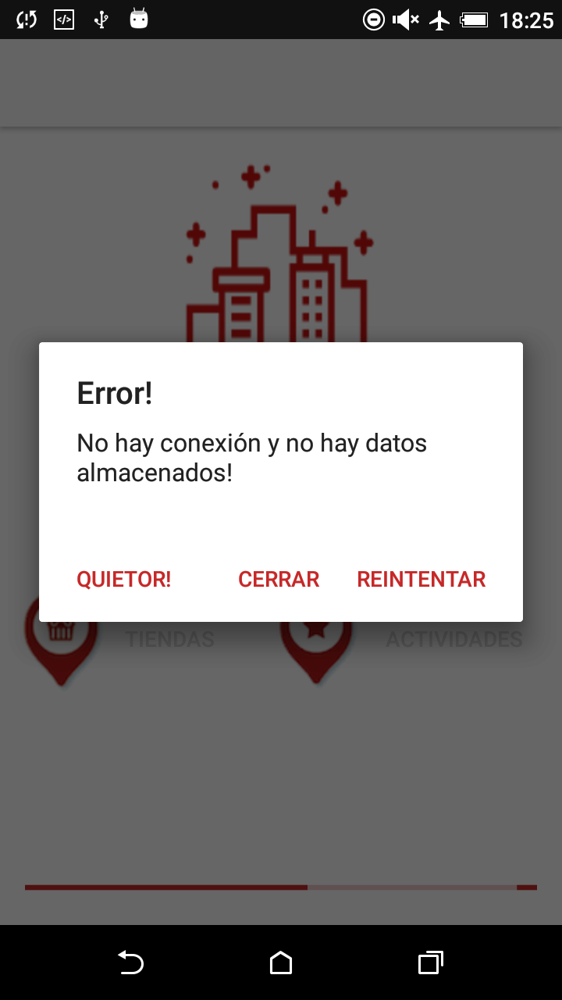

# Madrid Shops. V KC Bootcamp. Android Avanzado with Kotlin

## Predicate

Create a mobile application to display information of Shops and Events in Madrid, even when the user has no Internet connection. Shops and Activities should be shown in a Map.

### Requirements:

1. When starting the App for the first time, if there's Internet connection it will download all information from the Shops and Activities access point (see below), including all images.
2. The App will cache everything locally: images, data, etc. Even images of the maps. 
3. Cache is never invalidated, so once everything has been saved, set a flag and never ever access to the network again
4. If there's no Internet connection a message will be shown to the user.
5. While caching the App will show an Activity indicator or other loader. Until you finish caching you don't get to the Main menu.
6. The app will have a main menu screen where we'll add two buttons & a logo. The buttons takes us to the list of shops or activities.
7. The list of Shops/Activities will show in the upper 50% screen a map with one pin for each shop.
8. The list of Shops/Activities will show in the lower 50% screen. Logo to the left, background image taking all the row, shop name in the front. Tapping a row takes us to the detail shop screen.
9. All info should be read from a Core Data database
10. If you tap on a pin in the map a callout will open with the logo + shop/activity name. Taping the callout takes us to the detail shop/activity screen.
11. The map will be always centered in madrid, showing also the user location
12. All data is at least in Spanish & English: should cache all and display in Spanish (if that's our phone's language) or English otherwise
13. Shop/activity detail screen should show shop name, description, address, and a map showing the shops's/activity's location without any pin

### Extra Notes:
* Treat this exercise as an opportunity to demonstrate your skills and expertise to us in producing high quality, maintainable, and
reliable code.
* Use a git repository to track your code as you go along.
* To persist information while you're offline use Core Data! You can cache the images using any technique you like (Core Data, a library, archiving files, etc.)
* Clean architecture would be nice: interactors, managers, etc.
* Test: model, DAOs
* Merge all changes back to Master branch, that's what I'm going to look at!
* Add a README to the repo!
* Good luck and have fun coding!

### Web Services

- Shops: [https://madrid-shops.com/json_new/getShops.php](https://madrid-shops.com/json_new/getShops.php)
- Activities: [https://madrid-shops.com/json_new/getActivities.php](https://madrid-shops.com/json_new/getActivities.php)

## Student Notes

### Build and Runtime requirements
- Android Sudio 3.0 (October 2017)
- Emulated with an Android device: HTC Desire 820
	- Android Version: 6.0.1
	- API 23
- Extra libraries:
	- [Android-Debug-Database](https://github.com/amitshekhariitbhu/Android-Debug-Database): Used to check database on Web (only on debug mode)
	- [Multidex support](https://developer.android.com/studio/build/multidex.html): MultiDex Support to avoid 64k method limit
	- [Google Maps](https://developers.google.com/android/guides/setup): Google maps library
	- [Picasso](http://square.github.io/picasso/): A powerful image downloading and caching library for Android
	- [Volley](https://github.com/google/volley): HTTP library that makes networking for Android apps easier and, most importantly, faster.
	- [Jackson](https://github.com/FasterXML/jackson-module-kotlin): Faster XML


### Architecture

The practice is based on the application developed during the module classes. Part of the following functionality:

- Main view with a button, when you press the view with the list of shops is displayed.
- The list of shops is displayed in a custom cell with the logo on the left and the name in the center.
- By clicking on the cell, it shows the detail of the shops, with the description and the image of it.

From here, the code is adapted to complete the detailed points of the practice.

### Code details and model decisions

From the Shop and Shop model class and database, refactoring is done to transform it into Entity / Entities.

The classes Shop and Activity are kept and now they extends from Entity, and includes a new attribute: type.

It is also decided to unify and rename the table in database to ENTITY, adding one more column (TYPE).

### Installation

- It is recommended to use the detailed version in the previous notes, as well as the tests on a real device.
- Download project from this same repository: ```https://github.com/gemambu/Kotlin_MadridShops.git```
- open the project with Android Studio

### Additional features

- List view: when a pin is selected, the list is scrolled and shows the element
- Icon and background of the application. Generated with [logojoy.com] (https://logojoy.com). Assets generated with [makeappicon.com](makeappicon.com)
- _Easter egg_ sponsored by the wikiquote dedicated to [Gran Chiquito de la Calzada](https://es.wikiquote.org/wiki/Chiquito_de_la_Calzada). The easter egg can be seen testing the non-connection of the device, and also with two secret gestures (_onFling_ and _onLongPress_ in the main view) :)

### Possible improvements
 
- [ ] In the list view, add the option to search entity by name, and in turn highlight the corresponding pin on the map and the listing only shows that entity.
- [ ] Expand the model to enter the information of Services in Madrid.
- [ ] Add master-detail on tablets or devices with a minimum screen width


# Madrid Shops. V KC Bootcamp. Práctica Android Avanzado with Kotlin

## Enunciado

Crear una aplicación móvil para mostrar la información de Tiendas y Eventos en Madrid, incluso cuando el usuario no tenga conexión a internet. Las tiendas y Actividades deben mostrarse en un Mapa.


### Requerimientos:

1. Cuando se ejecute la App por primera vez, si hay conexión a internet se descargará toda la información de Tiendas y Actividades desde el punto de acceso (ver siguiente punto Web Services), incluyendo todas las imágenes.
2. La aplicación cacheará todo localmente: imágenes, datos, etc. Incluso las imágenes de los mapas.
3. La cache nunca queda invalidada, una vez todo ha sido almacenado, se almacenará un flag y nunca se deberá acceder de nuevo a la red.
4. Si no hay conexión a internet, se mostrará un mensaje al usuario.
5. Mientras la App está cacheando, se mostrará un indicador de Actividad u otro elemento similar. Mientras no se finalice el cacheo, no se mostrará el menú principal.
6. La aplicación tendrá una pantalla con un menú principal donde se añadirán dos botones y un logo. Los botones nos llevarán al listado de tiendas o actividades.
7. La lista de Tiendas / Actividades mostrará en la pantalla superior del 50% un mapa con un pin para cada tienda/actividad.
8. La lista de Tiendas / Actividades aparecerá en la pantalla inferior con un 50%. Logo a la izquierda, tomando toda la fila, nombre de la tienda/actividad en el frente. Tocar una fila nos lleva a la pantalla de la tienda/actividad de detalle.
9. Toda la información debe leerse desde una base de datos de Core Data
10. Si pulsa en un pin del mapa, se abrirá un popup con el logotipo + nombre de tienda / actividad. La pulsación del popup nos lleva a la pantalla de detalle de la tienda / actividad.
11. El mapa siempre estará centrado en Madrid, mostrando también la ubicación del usuario.
12. Todos los datos estarán al menos en castellano e inglés: debe almacenar en caché todo y mostrar en español (si es el idioma de nuestro teléfono) o inglés de otra manera
13. La pantalla de detalle de la tienda / actividad debe mostrar el nombre de la tienda, la descripción, la dirección y un mapa que muestre la ubicación de la tienda / actividad sin ningún pin.

### Notas Extra:
* Tratar este ejercicio como una oportunidad para demostrarnos tus habilidades y experiencia en la producción de código con alta calidad, mantenible y reutilizable.
* Utiliza un repositorio git para almacenar tu código a medida que avanza.
* Para persistir la información mientras estés offline, usa Core Data! Puede almacenar las imágenes en caché utilizando cualquier técnica que desee (datos básicos, una biblioteca, archivar archivos, etc.)
* La arquitectura limpia sería agradable: interactors, managers, etc.
* Test: modelo, DAOs
* Combinar todos los cambios de nuevo a rama master, eso es lo que voy a ver!
* ¡Añade un README al repo!
* ¡Buena suerte y diviértete codificando!

### Web Services

- Tiendas: [https://madrid-shops.com/json_new/getShops.php](https://madrid-shops.com/json_new/getShops.php)
- Actividades: [https://madrid-shops.com/json_new/getActivities.php](https://madrid-shops.com/json_new/getActivities.php)

## Notas del alumno

### Requisitos de generación y ejecución
- Android Sudio 3.0 (Octubre 2017)
- Emulado con un dispositivo Android: HTC Desire 820
	- Android Version: 6.0.1
	- API 23
- Librerías extra:
	- [Android-Debug-Database](https://github.com/amitshekhariitbhu/Android-Debug-Database): Utilizado para revisar la base de datos en web (disponible sólo en modo debug)
	- [Multidex support](https://developer.android.com/studio/build/multidex.html): MultiDex Support para evitar el límite de métodos de 64k
	- [Google Maps](https://developers.google.com/android/guides/setup): Librería de Google maps
	- [Picasso](http://square.github.io/picasso/): Una potente biblioteca de descarga y almacenamiento en caché de imágenes para Android
	- [Volley](https://github.com/google/volley): Biblioteca HTTP que hace que las redes para las aplicaciones de Android sean más fáciles y, lo que es más importante, más rápidas.
	- [Jackson](https://github.com/FasterXML/jackson-module-kotlin): Faster XML

	
### Arquitectura

La práctica se basa en la aplicación desarrollada durante las clases del módulo. Parte de la siguiente funcionalidad:

- Vista principal con un botón, al pulsar se muestra la vista con el listado de tiendas.
- El listado de tiendas se muestra en una celda personalizada, con el logo a la izquierda y el nombre en el centro.
- Al pinchar sobre la celda, se muestra el detalle de la tienda, con la descripción y la imagen de la misma.

A partir de aquí, se adapta el código para completar los puntos detallados de la práctica.

### Detalles de código y decisiones sobre el modelo

Desde la clase y la base de datos del modelo Shop and Shop, se realiza la refactorización para transformarla en Entity / Entities.

Las clases Shop y Activity se mantienen y ahora se extienden desde Entity e incluyen un nuevo atributo: tipo.

También se decide unificar y renombrar la tabla en base de datos a ENTITY, añadiendo una columna más (TYPE).


### Instalación

- Se recomienda utilizar la versión detallada en las notas previas, así como las pruebas sobre un dispoitivo real.
- descargar proyecto desde este mismo repositorio: ```https://github.com/gemambu/Kotlin_MadridShops.git```
- pod install
- Abrir el proyecto con Android Studio

### Extras

- Listado de entidades: cuando se selecciona un pin en el mapa, el listado se posiciona sobre el mismo elemento
- Icono y fondo de la aplicación. Generados con [logojoy.com](https://logojoy.com). Assets generados con [makeappicon.com](makeappicon.com)
- _Easter egg_ patrocinado por la wikiquote dedicada al [Gran Chiquito de la Calzada](https://es.wikiquote.org/wiki/Chiquito_de_la_Calzada). El easter egg se puede ver probando la falta de conexión del dispositivo, y también con dos gestos secretos (_onFling_ y _onLongPress_ en la vista principal) :)

### Posibles mejoras
 
- [ ]  En la vista de listado, añadir la opción de buscar entidad por nombre, y que a su vez destaque el pin correspondiente en el mapa y el listado sólo muestre esa entidad.
- [ ]  Ampliar el modelo para introducir la información de Servicios en Madrid.
- [ ]  Añadir maestro-detalle para tablets o dispositivos con un ancho de pantalla mínimo.


## DEMOS

### Mensaje sin conexión



### Uso de la App


